# Detecting Azure Cost Anomalies

Below we will walk through how to load cost data into Log Analytics to detect anomalies. This walkthrough uses a template to deploy a complet environment. If you want details on the template or would like a copy of the Azure Function being used then you can visit [App Service Template Repo](https://github.com/microsoft/CSAAppServiceDeployments)

## Deploying the Solution  

This architecture is made of of the following resources:  
- Azure Function App with System Managed Identity   
- Azure Log Analytics    
- Azure Application Insights  
- Azure Storage Account  

The below deployment will deploy these to the resource group that you define in Azure.

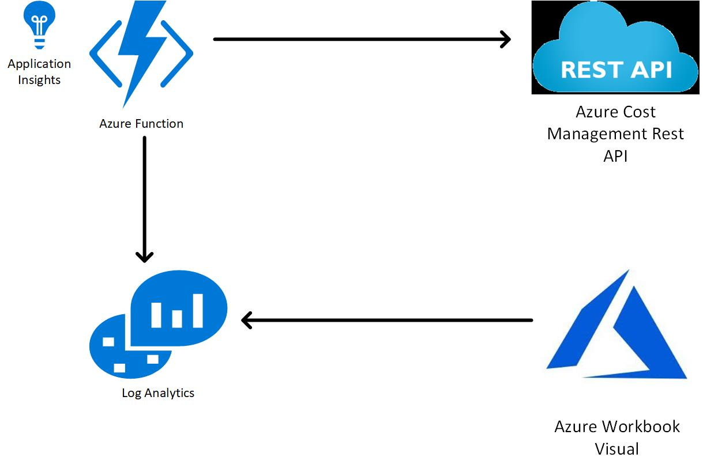  

The meat of this solution is an Azure Function that makes an API call to the Azure Cost Query API. It then takes those results an ingest them into Log Analytics workspace that is created by the template. The function is schdule to run each morning 4am.  

**Note** There are two parameters that you need to supply:  
1) deploymentPrefix: this will prefix the name of all the resources created.  
2) scope: this defines the scope or scopes for the Cost Management API. 
    - ex: subscriptions/5f1c1322-cebc-4ea3-8779-fac7d666e18f
    - ex: subscriptions/5f1c1322-cebc-4ea3-8779-fac7d666e18f, subscriptions/718c1322-cebc-4ea3-8779-fac7d666e18f  

#### Post Deployment Steps    
After deploying this solution you have to give the App Service System Assigned Managed Identity "Read" permissons at the scope or scopes that you are quering.  The system assigned managed identity will have the same name as your function app.  

If you want to load historical data into Log Analytics you can utilize the function named **PreLoadLogAnalytics**.  

1) Get the function url by opening the Function and clicking on **Get Function URL**. Note that it may take a little bit to light up.  
2) Use a tool like PostMan or Curl to send the request. Below is an example using curl.

**curl 'https://poccostingestionfadhr2puxbmgliy.azurewebsites.net/api/PreLoadLogAnalytics?code=ichangedthisstring'**

#### Import Azure Monitor Workbook    
Azure Workbooks are a great option to get insights from the data in the csv file. We'll generate a Workbook that looks for anamalies in the cost per ResourceGroup.

1) Open Azure Monitor and open the Workbooks tab    

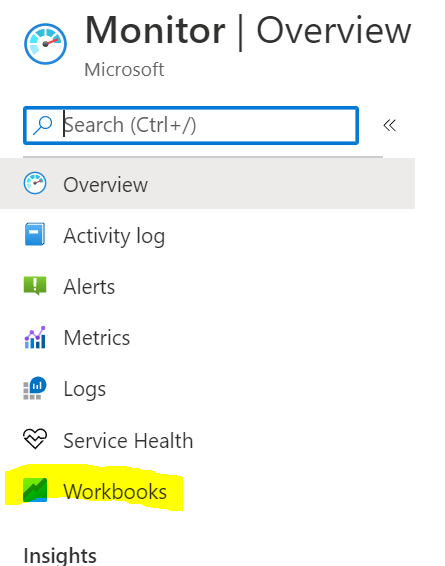 

2) In the main pain click on "New" at the top:  

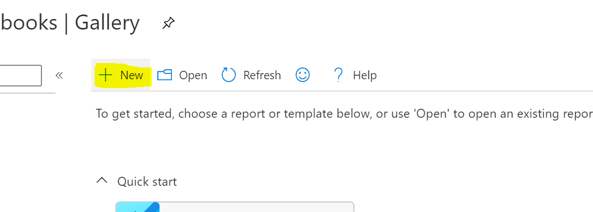 

3) On the top toolbar click on **Advanced Editor**

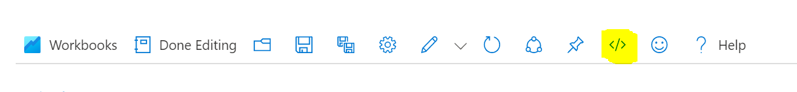  

4) In the editor past the content of **CostWorkbook.json** in this repo

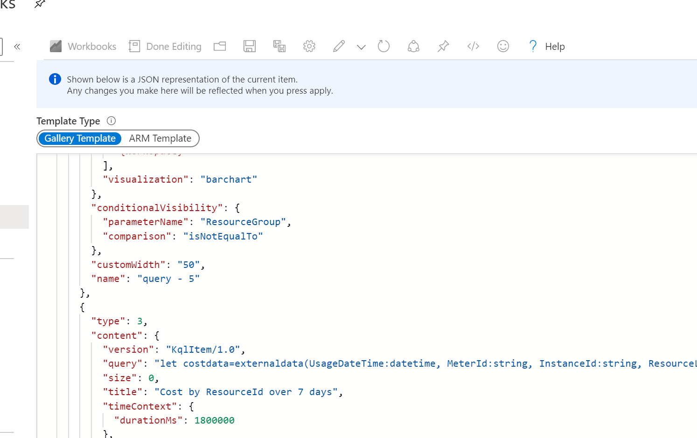  

5) Click on **Apply** to enter the editing Windows.  

7) Go ahead and select a Log Analytics Workspace from the drop down. Make sure you select the Log Analytics workspace created by the template.   

8) Click on the **Save** button. Give your workook a name and place it in a resource group. If you want others to be able to see it save it as a **Shared** workbook.  

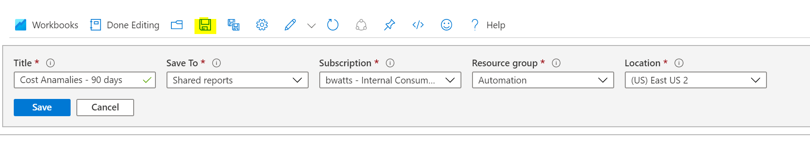  

9) You can now click on **Done Editing** and start to utilize the workbook.  

## Alerting  
We can now work on setting up alerting on anamalies. In the below example we'll utilize Logic App to execute once a day and look for any **Resource Group** that had an anomalie.  

1) Create a new Logic Apps and select "Blank Logic App" Template  

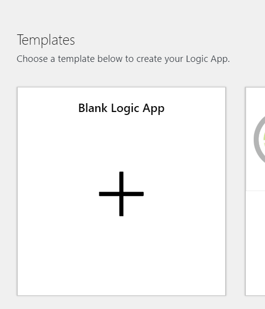 

2) The Logic App Designer will open with the trigger selection available. Look for **Storage Account** and select the **Azure Blob Storage**  

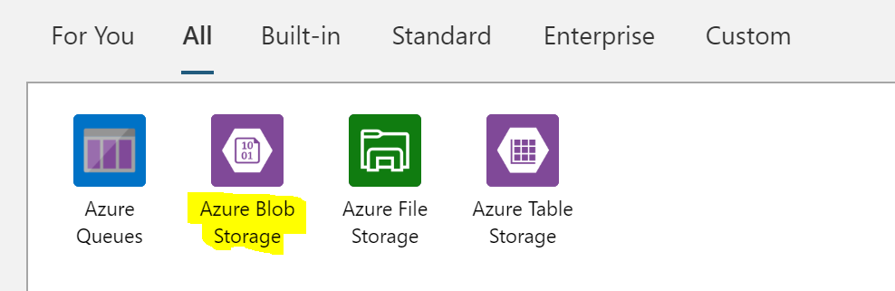  

3) Choose the **When a blob is added or midified** trigger  

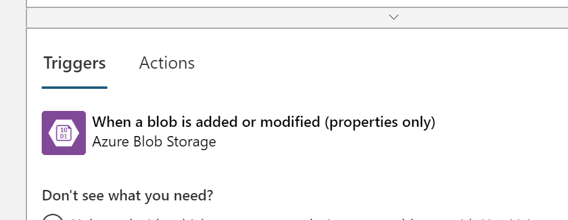  

4) Being this is your first time connecting to a storage account you'll need to select the SA. Below I've named my connection CostStorage and then seleted the account I want to place the cost data into. Once selected you need to select **Create** at the bottom.

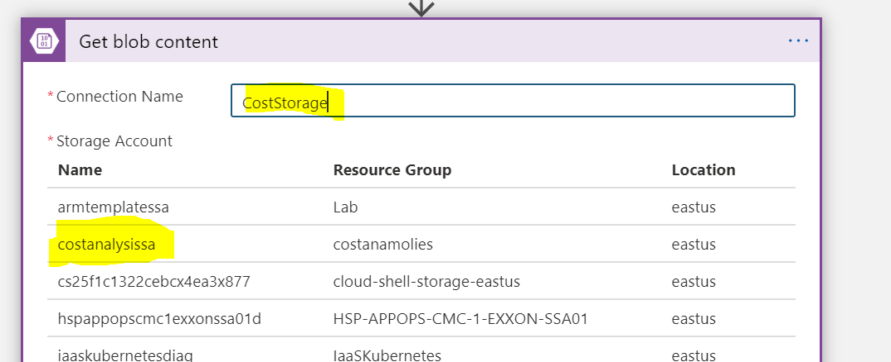 

5) In the **Container** property you need to put the folder where you placed the csv file. This was done in the **Add Management of Blob Output** step 8  

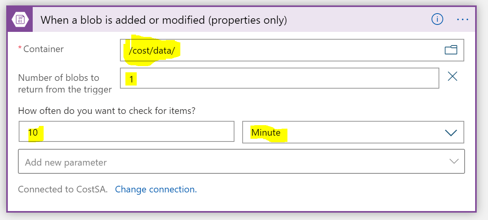  

6) Below your trigger click on **Add New Step** and look for **Azure Monitor**. You'll select the **Azure Monitor Logs**  

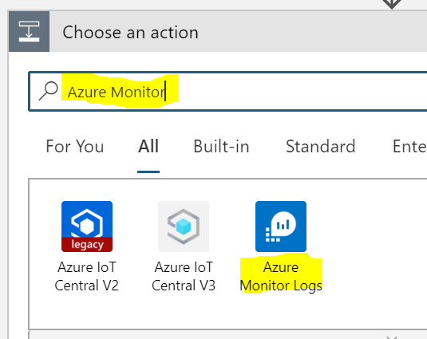  

7) Select the **Run Query and Visualize Results** action

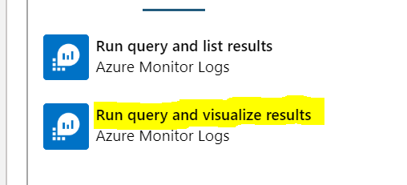  

8) Fill in the Properties:  

- Subscription: Suscription where the Log Analytics Workspace is located  
- Resource Group: Resource Group where the Log Analytics Workspace is located  
- Resource Type: Log Analytics Workspace  
- Resource Name: Name of Log Analytics Workspace  
- Query: Enter the below **Change the URI connection to the Blob csv file**  

    let costdata=externaldata(UsageDateTime:datetime, MeterId:string, InstanceId:string, ResourceLocation:string,   PreTaxCost:decimal,ResourceGroup:string, ResourceType:string, Tags:string )  
    [  
    h@"**\<BlobURI\>\<SASToken\>**"  
    ]  
    with(format="csv",ignoreFirstRecord=true);  
    let ids=costdata  
    | order by UsageDateTime  
    | where PreTaxCost >= 5  
    | make-series Cost=sum(PreTaxCost) on UsageDateTime in range(startofday(ago(90d)), endofday(ago(1d)), 1d) by ResourceGroup  
    | extend outliers=series_decompose_anomalies(Cost)  
    | mvexpand outliers, UsageDateTime  
    | summarize arg_max(todatetime(UsageDateTime), *) by ResourceGroup  
    | where outliers>=1   
    | distinct ResourceGroup;  
    costdata  
    | where ResourceGroup in (ids)  
    | where UsageDateTime >= ago(7d)  
    | summarize PreTaxCost=sum(PreTaxCost) by ResourceGroup, UsageDateTime  
    | order by ResourceGroup, UsageDateTime desc  

    - Time Range: 90d  
    - Chart Type: HTML Table  

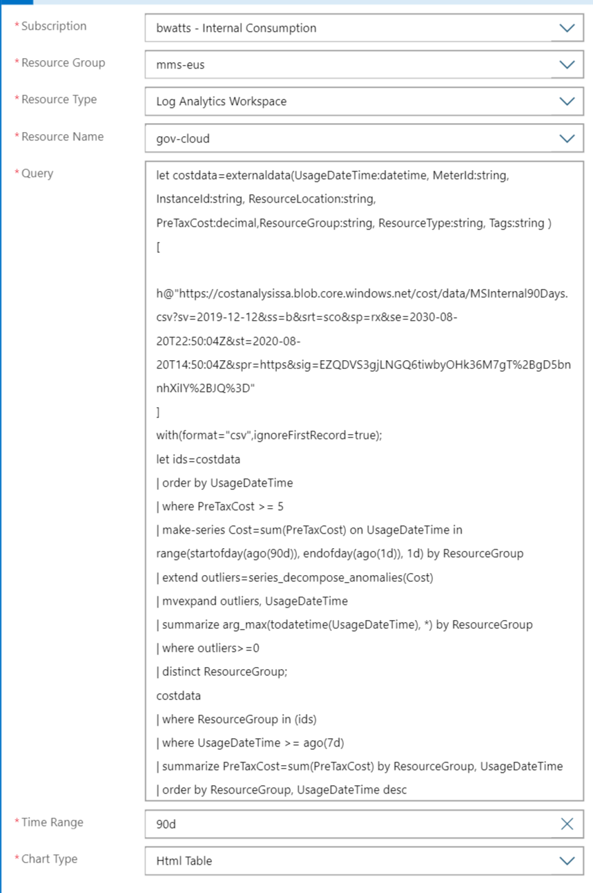  

9) Click on **New Action** below the **Run Query and Visualize Results**. Search for **Condition** and select **Control**.  

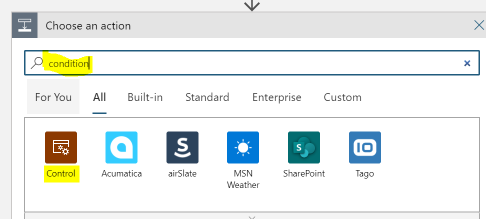  

10) In the **Control** actions choose **Condition**  

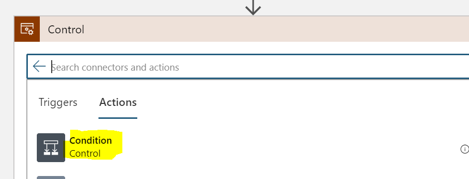  

11) In the **Condition** use the following properties:  
- **Dynamic Fied**: Attachment Content  
- **Not Equal to**
- PGJvZHk+VGhlIHF1ZXJ5IHlpZWxkZWQgbm8gZGF0YVRhYmxlLjwvYm9keT4=  

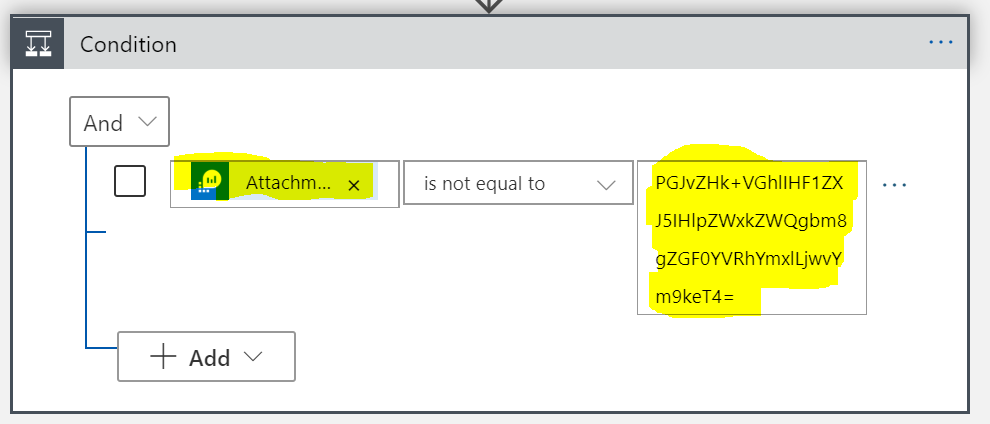  

12) In the **If true** section click on **Add an Action**  

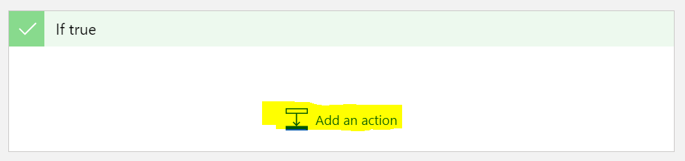

13) Repeate steps 6-8 but ths time use the below query  

    let costdata=externaldata(UsageDateTime:datetime, MeterId:string, InstanceId:string, ResourceLocation:string,   PreTaxCost:decimal,ResourceGroup:string, ResourceType:string, Tags:string )  
    [  
    h@"**\<BlobURI\>\<SASToken\>**"    
    ]  
    with(format="csv",ignoreFirstRecord=true);  
    let ids=costdata  
    | order by UsageDateTime  
    | where PreTaxCost >= 5  
    | make-series Cost=sum(PreTaxCost) on UsageDateTime in range(startofday(ago(90d)), endofday(ago(1d)), 1d) by ResourceGroup  
    | extend outliers=series_decompose_anomalies(Cost)  
    | mvexpand outliers, UsageDateTime  
    | summarize arg_max(todatetime(UsageDateTime), *) by ResourceGroup  
    | where outliers>=1  
    | distinct ResourceGroup;  
    costdata  
    | where ResourceGroup in (ids)  
    | where UsageDateTime >= ago(7d)  
    | summarize PreTaxCost=sum(PreTaxCost) by InstanceId, UsageDateTime  
    | order by InstanceId, UsageDateTime desc  

14) Add a new action after the last step (but still in the **if true** section) and search for **Outlook**. Choose the **Office 365 Outllok** actions  

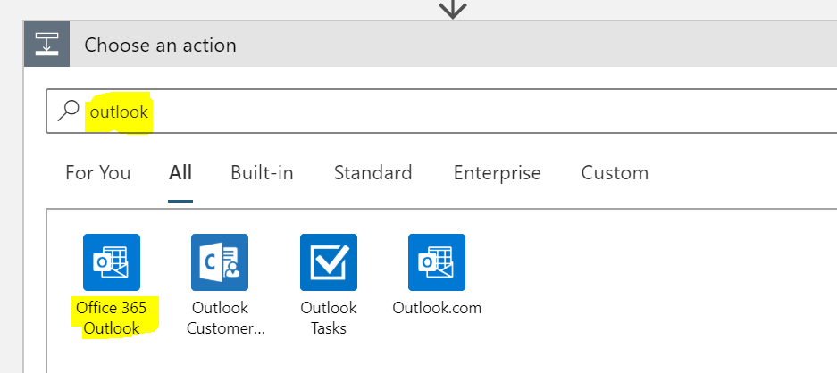  

15) In the actions windows search for **Send email** and choose **Send an email (v2)**. Note: This action will send an email from your email account. For production you would want to setup a **shared mailbox** and choose the action **Send an email from a shared mailbox (v2)**  

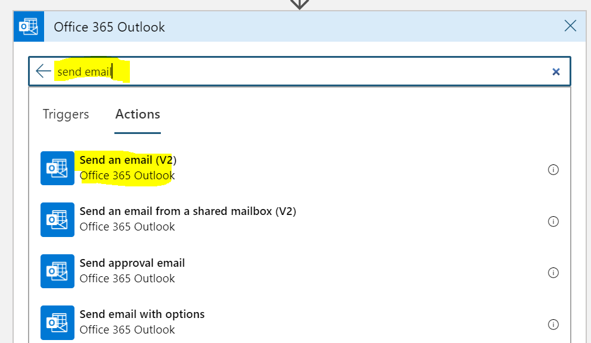  

16) The first time using this connector it ask you to login to Office 365 to make the connection. Once you've done this fill in the following properties:  

- Body: You can fill in whatever you want for the body. Below is an example of what I entered:  
    Cost Anamolies were deteted for Resource Groups in your environment. Attached are the details on the Resource Groups causing the anamolies and the Resources in those Resource Groups.  
- Subject: You can fill in whatever you want for the subject. Below is an example of what I entered:  
    RG Cost Anamolies  
- To: Whoever you want to recieve the emails. This can be a ; deliminated list  
- Click on **Add new Parameter** and click the check box next to **Attachments**. Click back in on of the other fields like **To:** to make the attachment parameters available.  
- Click on **Add new Item** so that you have two atachments available. Fill in the following for the Attachement Parameters:  
    - **Attachments Content - 1**: From the Dynamic Content select the **Attchment Content** from **Run Query and Visualize Results**. It should be the second one in the list.

 

    - **Attachments Content - 1**: From the Dynamic Content select the **Attchment Content** from **Run Query and Visualize Results**. It should be the second one in the list. 
    - **Attachments Name - 1**: RGCost7Days.html
    - **Attachments Content - 2**: From the Dynamic Content select the **Attchment Content** from **Run Query and Visualize Results 2**. It should be the first one in the list. 
    - **Attachements Name - 2**: ResourceIdCost7Days.html  

17) **Save** the Logic App and click on **Run**. The next time the csv file is updated on the blob this logic app should run and alert if there is any anamolies.  

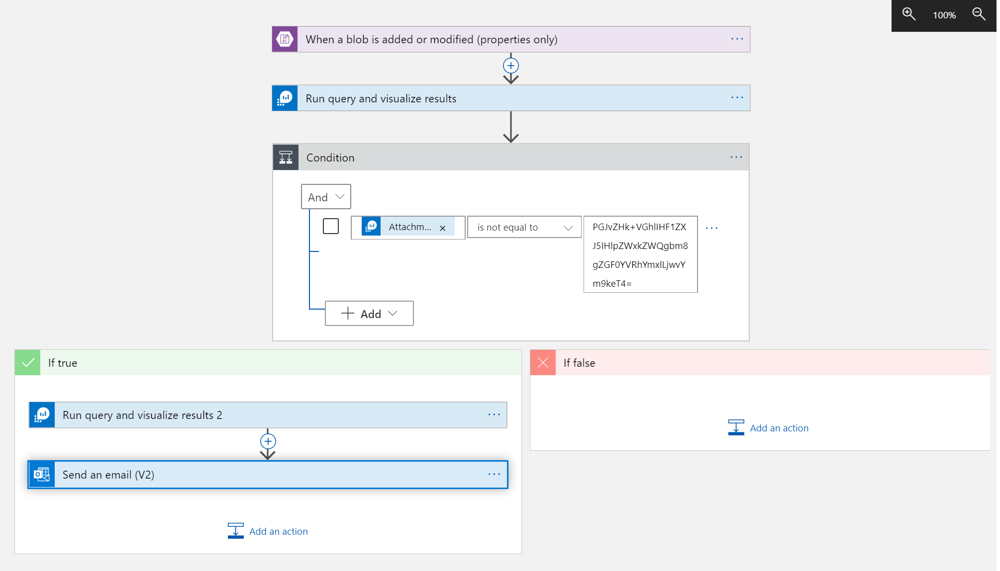 